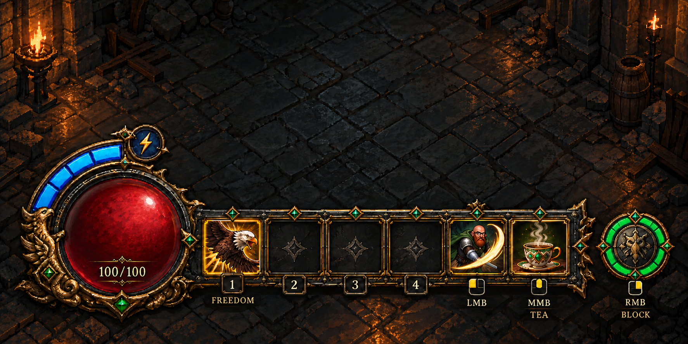

# The Beard and Blade — hotbar HUD v3

Start with [HOME_PC_HANDOFF.md](HOME_PC_HANDOFF.md) to implement this design in the latest UE5 build.

Red health orb; blue stamina arc; slots 1 FREEDOM, 2–4 reserved, LMB attack, MMB TEA; separate green RMB BLOCK meter. Block lasts at most five seconds, followed by a three-second cooldown. Keep the BLOCK label, without the static timing caption.

This is a flattened visual reference, not a ready-to-import layered HUD. The home PC must prepare transparent components and wire live stats, ability state, input mappings and cooldown countdowns. No gameplay files are changed by this art upload.

The generation prompt is included for future visual revisions. Its historical local source is not required to use the final preview.
