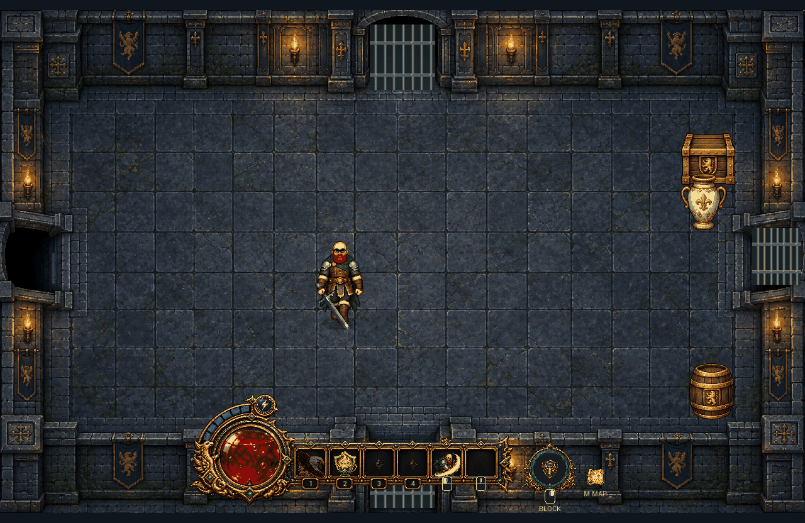

# Tea Spirit — skill 2 preview

Actual in-game capture: raise the cup, sip, lower it, then move with a pulsing gold glow and soft outward-radiating waves.

[Open/download the MP4](tea-spirit.mp4?raw=true)

The action uses eight dedicated drinking poses. Protection lasts five seconds from activation, including the 1.2-second drinking animation. Movement is boosted by 50%; recharge takes 30 seconds after the effect ends.

This branch contains preview media only. The main branch and published game release have not been updated.